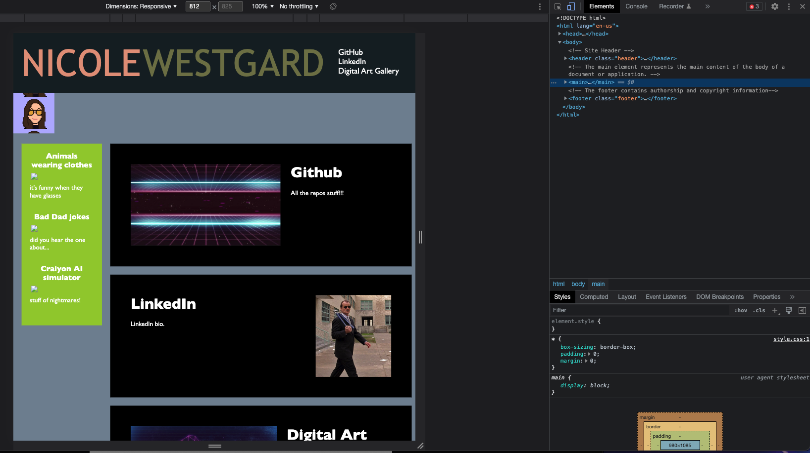

# Web Development Portfolio

## Description

This is Nicole Westgard's website development portfolio. Here you will find all of my current web development projects, links that I think are fun, and my contact information. 

## Installation
To view the project in your browser:
1. You will need to clone down the repository from GitHub to your local machine. 
2. Once you have the project locally, you will need to open it in VSCode IDE. Right-click on the `index.html` file, then select `default browser` from the dropdown menu. This will open the HTML page in the broswer of your choice.

## Deployment

Application is deployed through Github Pages, live URL [Portfolio Website Link](https://westgards.github.io/portfolio/src/)

## Credits

Tutorials:

[U of MN Coding Bootcamp Link](https://github.com/coding-boot-camp)

[Title color change Animation Link](https://alvarotrigo.com/blog/css-text-animations/)

## License

Copyright (c) 2022 nicolewestgard. 

Licensed under the MIT license. [MIT license Repo Link](https://github.com/westgards/portfolio/blob/main/LICENSE) license.

## Features
- Alternative text descriptions added to images for accessiblity
- Semantic tag usage in HTML
- Proper Heading levels and nesting to better organize the website content
- Descriptive URLS for Hyperlinks
- Webpage supports rezing and ciew website on various screens and devices
- Advanced CSS: css variables + keyframes
